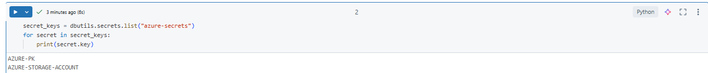

# Terraform Azure Databricks Infrastructure

## Overview
This project involves setting up the necessary cloud infrastructure using Terraform and connecting to an Azure Databricks workspace.

## Steps Taken

### 1. Running Terraform Scripts
I executed my Terraform scripts to create the required cloud infrastructure on Microsoft Azure. The Terraform configuration included:
- **Resource Group**: Created to organize Azure resources.
- **Virtual Network & Subnets**: Configured to support secure communication.
- **Databricks Workspace**: Deployed as a managed Azure resource.
- **Storage Accounts & Containers**: Provisioned for storing data.
- **Security & IAM Roles**: Configured permissions for secure access.

### 2. Connecting to Azure Databricks Workspace
After the infrastructure was successfully provisioned, I connected to the Azure Databricks workspace using:
- The Azure Portal for direct UI access.
- The Databricks CLI for command-line operations.

### 3. Configuring the Cluster
Once connected to Databricks, I set up a cluster for computation. The configuration details are:
- **Cluster Type**: Single Node
- **Instance Type**: Standard_DS3_v2


### 4. Creating a Notebook and Managing Secrets
After setting up the cluster, I created a notebook in Databricks to run scripts and execute data processing tasks. Additionally, I configured secrets using the Databricks Secret API and the Databricks CLI to securely store sensitive information such as credentials and keys.




### 5. Connecting to Azure Storage
After creating the Databricks secrets, I connected to the Azure Storage account using the following configuration in my Databricks notebook:
```python
storage_account = dbutils.secrets.get(scope='azure-secrets', key='AZURE-STORAGE-ACCOUNT')
container_name = "data"
spark.conf.set(
    f"fs.azure.account.key.{storage_account}.dfs.core.windows.net",
    dbutils.secrets.get(scope="azure-secrets", key="AZURE-PK")
)
```
This setup allows Databricks to securely access the Azure Storage account for data processing.

### 6. Reading and Writing Data
After successfully connecting to the Azure Storage account, I tested the integration by reading data and writing it in Delta format:
```python
df = spark.read.load(f"abfss://{container_name}@{storage_account}.dfs.core.windows.net/expedia-delta/")
display(df)

df.write.format("delta").mode("overwrite").save(f"abfss://{container_name}@{storage_account}.dfs.core.windows.net/expedia-delta")
```
I verified that everything worked correctly by displaying the data and confirming that it was successfully written in Delta format.

### 7. Creating a Delta Table
To structure the data for analysis, I created a Delta table using SQL:
```sql
%sql
-- Create the Delta table using SQL
CREATE TABLE expedia_delta
LOCATION 'abfss://data@stedaswesteuropefh9x.dfs.core.windows.net/expedia-delta';
```
This allows for efficient querying and processing of the data stored in Delta format.

### 8. Processing Hotel-Weather Data
I performed the same steps for the **hotel-weather** dataset as I did for the **expedia** dataset. This included:
- Reading the data from the storage account:
  ```python
  df = spark.read.format("parquet").load(f"abfss://{container_name}@{storage_account}.dfs.core.windows.net/hotel-weather/")
  display(df)
  ```
- Writing the data in Delta format:
  ```python
  df.write.format("delta").mode("overwrite").save(f"abfss://{container_name}@{storage_account}.dfs.core.windows.net/hotel-weather-delta")
  ```
- Creating a Delta table for structured querying:
  ```sql
  %sql
  -- Create the Delta table using SQL
  CREATE TABLE hotel_weather_delta
  LOCATION 'abfss://data@stedaswesteuropefh9x.dfs.core.windows.net/hotel-weather-delta';
  ```

### 9. Top 10 Hotels with Maximum Absolute Temperature Difference by Month
To analyze the temperature variations, I ran the following SQL query:
```sql
WITH temperature_diff AS (
    SELECT 
        hwd.name AS hotel_name,
        hwd.month,
        hwd.year,
        ABS(MAX(avg_tmpr_c) - MIN(avg_tmpr_c)) AS temp_diff
    FROM hotel_weather_delta hwd
    GROUP BY hotel_name, hwd.year, hwd.month
)
SELECT hotel_name, year, month, FORMAT_NUMBER(temp_diff, 2) AS `Temperature difference`
FROM temperature_diff
ORDER BY temp_diff DESC
LIMIT 10;
```
This query calculates the absolute temperature difference for each hotel per month, ranks them in descending order, and returns the top 10 hotels with the highest temperature variation.


#### Execution plan
```
== Physical Plan ==
AdaptiveSparkPlan isFinalPlan=false
+- == Initial Plan ==
   ColumnarToRow
   +- PhotonResultStage
      +- PhotonProject [hotel_name#2213, year#2262, month#2263, Temperature difference#2212]
         +- PhotonTopK(sortOrder=[temp_diff#2214 DESC NULLS LAST], partitionOrderCount=0)
            +- PhotonShuffleExchangeSource
               +- PhotonShuffleMapStage
                  +- PhotonShuffleExchangeSink SinglePartition
                     +- PhotonTopK(sortOrder=[temp_diff#2214 DESC NULLS LAST], partitionOrderCount=0)
                        +- PhotonProject [hotel_name#2213, year#2262, month#2263, format_number(temp_diff#2214, 2) AS Temperature difference#2212, temp_diff#2214]
                           +- PhotonGroupingAgg(keys=[name#2260, year#2262, month#2263], functions=[finalmerge_max(merge max#2269) AS max(avg_tmpr_c#2252)#2265, finalmerge_min(merge min#2271) AS min(avg_tmpr_c#2252)#2266])
                              +- PhotonShuffleExchangeSource
                                 +- PhotonShuffleMapStage
                                    +- PhotonShuffleExchangeSink hashpartitioning(name#2260, year#2262, month#2263, 200)
                                       +- PhotonGroupingAgg(keys=[name#2260, year#2262, month#2263], functions=[partial_max(avg_tmpr_c#2252) AS max#2269, partial_min(avg_tmpr_c#2252) AS min#2271])
                                          +- PhotonScan parquet spark_catalog.default.hotel_weather_delta[avg_tmpr_c#2252,name#2260,year#2262,month#2263] DataFilters: [], DictionaryFilters: [], Format: parquet, Location: PreparedDeltaFileIndex(1 paths)[abfss://data@[REDACTED].dfs.core.windows.net/hotel-weat..., OptionalDataFilters: [], PartitionFilters: [], ReadSchema: struct<avg_tmpr_c:double,name:string,year:int,month:int>, RequiredDataFilters: []


== Photon Explanation ==
The query is fully supported by Photon.
```

#### 9.1 Intermediate data temperature diff
```sql
    EXPLAIN EXTENDED
    WITH temperature_diff AS (
        SELECT 
            hwd.name AS hotel_name,
            hwd.month,
            hwd.year,
            ABS(MAX(avg_tmpr_c) - MIN(avg_tmpr_c)) AS temp_diff
        FROM hotel_weather_delta hwd
        GROUP BY hotel_name, hwd.year, hwd.month
    )
    SELECT * FROM temperature_diff
```
EXECUTION PLAN
```
== Physical Plan ==
AdaptiveSparkPlan isFinalPlan=false
+- == Initial Plan ==
   ColumnarToRow
   +- PhotonResultStage
      +- PhotonGroupingAgg(keys=[name#4695, year#4697, month#4698], functions=[finalmerge_max(merge max#4704) AS max(avg_tmpr_c#4687)#4700, finalmerge_min(merge min#4706) AS min(avg_tmpr_c#4687)#4701])
         +- PhotonShuffleExchangeSource
            +- PhotonShuffleMapStage
               +- PhotonShuffleExchangeSink hashpartitioning(name#4695, year#4697, month#4698, 200)
                  +- PhotonGroupingAgg(keys=[name#4695, year#4697, month#4698], functions=[partial_max(avg_tmpr_c#4687) AS max#4704, partial_min(avg_tmpr_c#4687) AS min#4706])
                     +- PhotonScan parquet spark_catalog.default.hotel_weather_delta[avg_tmpr_c#4687,name#4695,year#4697,month#4698] DataFilters: [], DictionaryFilters: [], Format: parquet, Location: PreparedDeltaFileIndex(1 paths)[abfss://data@[REDACTED].dfs.core.windows.net/hotel-weat..., OptionalDataFilters: [], PartitionFilters: [], ReadSchema: struct<avg_tmpr_c:double,name:string,year:int,month:int>, RequiredDataFilters: []


== Photon Explanation ==
The query is fully supported by Photon.
```
### 10. Top 10 Busiest Hotels by Month
To identify the top 10 busiest hotels per month based on visit counts, I ran the following SQL query:
```sql
WITH stay_periods AS (
    SELECT
        ed.id AS stay_id,
        ed.hotel_id,
        ed.srch_ci AS check_in_date,
        ed.srch_co AS check_out_date,
        year(ed.srch_ci) AS check_in_year,
        month(ed.srch_ci) AS check_in_month,
        year(ed.srch_co) AS check_out_year,
        month(ed.srch_co) AS check_out_month
    FROM expedia_delta ed
    WHERE ed.srch_ci <= ed.srch_co
),
date_series AS (
    SELECT
        stay_id,
        hotel_id,
        explode(sequence(
            date_trunc('month', check_in_date),
            date_trunc('month', check_out_date),
            interval 1 month
        )) AS month
    FROM stay_periods
)
SELECT 
    hwd.name AS hotel_name,
    ds.hotel_id,
    COUNT(DISTINCT ds.stay_id) AS Stay_Count,
    year(ds.month) AS year,
    month(ds.month) AS month
FROM date_series ds
JOIN hotel_weather_delta hwd ON ds.hotel_id = hwd.id
GROUP BY hwd.name, ds.hotel_id, year(ds.month), month(ds.month)
ORDER BY Stay_Count DESC
LIMIT 10;
```
This query ensures that if visit dates span multiple months, they are counted for all affected months, and it retrieves the top 10 busiest hotels based on the number of distinct stays.


#### Execution plan
```
== Physical Plan ==
AdaptiveSparkPlan isFinalPlan=false
+- == Initial Plan ==
   TakeOrderedAndProject(limit=10, orderBy=[Stay_Count#2486L DESC NULLS LAST], output=[hotel_name#2485,hotel_id#2551L,Stay_Count#2486L,year#2487,month#2488])
   +- HashAggregate(keys=[name#2575, hotel_id#2551L, _groupingexpression#2584, _groupingexpression#2585], functions=[finalmerge_count(distinct merge count#2589L) AS count(stay_id#2489L)#2583L])
      +- Exchange hashpartitioning(name#2575, hotel_id#2551L, _groupingexpression#2584, _groupingexpression#2585, 200), ENSURE_REQUIREMENTS, [plan_id=4445]
         +- HashAggregate(keys=[name#2575, hotel_id#2551L, _groupingexpression#2584, _groupingexpression#2585], functions=[partial_count(distinct stay_id#2489L) AS count#2589L])
            +- HashAggregate(keys=[name#2575, hotel_id#2551L, _groupingexpression#2584, _groupingexpression#2585, stay_id#2489L], functions=[])
               +- Exchange hashpartitioning(name#2575, hotel_id#2551L, _groupingexpression#2584, _groupingexpression#2585, stay_id#2489L, 200), ENSURE_REQUIREMENTS, [plan_id=4442]
                  +- HashAggregate(keys=[name#2575, hotel_id#2551L, _groupingexpression#2584, _groupingexpression#2585, stay_id#2489L], functions=[])
                     +- Project [stay_id#2489L, hotel_id#2551L, name#2575, year(cast(month#2581 as date)) AS _groupingexpression#2584, month(cast(month#2581 as date)) AS _groupingexpression#2585]
                        +- BroadcastHashJoin [hotel_id#2551L], [cast(id#2572 as bigint)], Inner, BuildRight, false, true
                           :- Generate explode(sequence(date_trunc(month, cast(check_in_date#2490 as timestamp), Some(Etc/UTC)), date_trunc(month, cast(check_out_date#2491 as timestamp), Some(Etc/UTC)), Some(INTERVAL '1' MONTH), Some(Etc/UTC))), [stay_id#2489L, hotel_id#2551L], false, [month#2581]
                           :  +- ColumnarToRow
                           :     +- PhotonResultStage
                           :        +- PhotonProject [id#2532L AS stay_id#2489L, hotel_id#2551L, srch_ci#2544 AS check_in_date#2490, srch_co#2545 AS check_out_date#2491]
                           :           +- PhotonScan parquet spark_catalog.default.expedia_delta[id#2532L,srch_ci#2544,srch_co#2545,hotel_id#2551L] DataFilters: [isnotnull(hotel_id#2551L), isnotnull(srch_ci#2544), isnotnull(srch_co#2545), (srch_ci#2544 <= sr..., DictionaryFilters: [], Format: parquet, Location: PreparedDeltaFileIndex(1 paths)[abfss://data@[REDACTED].dfs.core.windows.net/expedia-de..., OptionalDataFilters: [], PartitionFilters: [], ReadSchema: struct<id:bigint,srch_ci:string,srch_co:string,hotel_id:bigint>, RequiredDataFilters: [isnotnull(hotel_id#2551L), isnotnull(srch_ci#2544), isnotnull(srch_co#2545), (srch_ci#2544 <= sr...
                           +- Exchange SinglePartition, EXECUTOR_BROADCAST, [plan_id=4438]
                              +- ColumnarToRow
                                 +- PhotonResultStage
                                    +- PhotonScan parquet spark_catalog.default.hotel_weather_delta[id#2572,name#2575] DataFilters: [isnotnull(id#2572)], DictionaryFilters: [], Format: parquet, Location: PreparedDeltaFileIndex(1 paths)[abfss://data@[REDACTED].dfs.core.windows.net/hotel-weat..., OptionalDataFilters: [], PartitionFilters: [], ReadSchema: struct<id:string,name:string>, RequiredDataFilters: [isnotnull(id#2572)]


== Photon Explanation ==
Photon does not fully support the query because:

	sequence(date_trunc(month, cast(check_in_date#2490 as timestamp), Some(Etc/UTC)), date_trunc(month, cast(check_out_date#2491 as timestamp), Some(Etc/UTC)), Some(INTERVAL '1' MONTH), Some(Etc/UTC)) is not supported:
		Expression sequence does not support TimestampType.

Reference node:
	Generate explode(sequence(date_trunc(month, cast(check_in_date#2490 as timestamp), Some(Etc/UTC)), date_trunc(month, cast(check_out_date#2491 as timestamp), Some(Etc/UTC)), Some(INTERVAL '1' MONTH), Some(Etc/UTC))), [stay_id#2489L, hotel_id#2551L], false, [month#2581]

Photon does not fully support the query because:
		Unsupported node: Exchange SinglePartition, EXECUTOR_BROADCAST, [plan_id=4412].

Reference node:
	Exchange SinglePartition, EXECUTOR_BROADCAST, [plan_id=4438]
```
#### 10.1 Intermediate data stay_period
```sql
EXPLAIN EXTENDED
WITH stay_periods AS (
    SELECT
        ed.id AS stay_id,
        ed.hotel_id,
        ed.srch_ci AS check_in_date,
        ed.srch_co AS check_out_date,
        year(ed.srch_ci) AS check_in_year,
        month(ed.srch_ci) AS check_in_month,
        year(ed.srch_co) AS check_out_year,
        month(ed.srch_co) AS check_out_month
    FROM expedia_delta ed
    WHERE ed.srch_ci <= ed.srch_co
)
SELECT * FROM stay_periods
```

EXECUTION PLAN
```
== Physical Plan ==
*(1) ColumnarToRow
+- PhotonResultStage
   +- PhotonProject [id#4936L AS stay_id#4894L, hotel_id#4955L, srch_ci#4948 AS check_in_date#4895, srch_co#4949 AS check_out_date#4896, year(cast(srch_ci#4948 as date)) AS check_in_year#4897, month(cast(srch_ci#4948 as date)) AS check_in_month#4898, year(cast(srch_co#4949 as date)) AS check_out_year#4899, month(cast(srch_co#4949 as date)) AS check_out_month#4900]
      +- PhotonScan parquet spark_catalog.default.expedia_delta[id#4936L,srch_ci#4948,srch_co#4949,hotel_id#4955L] DataFilters: [isnotnull(srch_ci#4948), isnotnull(srch_co#4949), (srch_ci#4948 <= srch_co#4949)], DictionaryFilters: [], Format: parquet, Location: PreparedDeltaFileIndex(1 paths)[abfss://data@[REDACTED].dfs.core.windows.net/expedia-de..., OptionalDataFilters: [], PartitionFilters: [], ReadSchema: struct<id:bigint,srch_ci:string,srch_co:string,hotel_id:bigint>, RequiredDataFilters: [isnotnull(srch_ci#4948), isnotnull(srch_co#4949), (srch_ci#4948 <= srch_co#4949)]


== Photon Explanation ==
The query is fully supported by Photon.
```
#### 10.2 intermediate data data_series
```
EXPLAIN EXTENDED
WITH stay_periods AS (
    SELECT
        ed.id AS stay_id,
        ed.hotel_id,
        ed.srch_ci AS check_in_date,
        ed.srch_co AS check_out_date
    FROM expedia_delta ed
    WHERE ed.srch_ci <= ed.srch_co
),
date_series AS (
    SELECT
        stay_id,
        hotel_id,
        explode(sequence(
            date_trunc('month', check_in_date),
            date_trunc('month', check_out_date),
            interval 1 month
        )) AS month
    FROM stay_periods
)
SELECT * FROM date_series;
```

EXECUTION PLAN
```
== Physical Plan ==
*(1) Generate explode(sequence(date_trunc(month, cast(check_in_date#5216 as timestamp), Some(Etc/UTC)), date_trunc(month, cast(check_out_date#5217 as timestamp), Some(Etc/UTC)), Some(INTERVAL '1' MONTH), Some(Etc/UTC))), [stay_id#5215L, hotel_id#5278L], false, [month#5280]
+- *(1) ColumnarToRow
   +- PhotonResultStage
      +- PhotonProject [id#5259L AS stay_id#5215L, hotel_id#5278L, srch_ci#5271 AS check_in_date#5216, srch_co#5272 AS check_out_date#5217]
         +- PhotonScan parquet spark_catalog.default.expedia_delta[id#5259L,srch_ci#5271,srch_co#5272,hotel_id#5278L] DataFilters: [isnotnull(srch_ci#5271), isnotnull(srch_co#5272), (srch_ci#5271 <= srch_co#5272)], DictionaryFilters: [], Format: parquet, Location: PreparedDeltaFileIndex(1 paths)[abfss://data@[REDACTED].dfs.core.windows.net/expedia-de..., OptionalDataFilters: [], PartitionFilters: [], ReadSchema: struct<id:bigint,srch_ci:string,srch_co:string,hotel_id:bigint>, RequiredDataFilters: [isnotnull(srch_ci#5271), isnotnull(srch_co#5272), (srch_ci#5271 <= srch_co#5272)]


== Photon Explanation ==
Photon does not fully support the query because:

	sequence(date_trunc(month, cast(check_in_date#5216 as timestamp), Some(Etc/UTC)), date_trunc(month, cast(check_out_date#5217 as timestamp), Some(Etc/UTC)), Some(INTERVAL '1' MONTH), Some(Etc/UTC)) is not supported:
		Expression sequence does not support TimestampType.

Reference node:
	Generate explode(sequence(date_trunc(month, cast(check_in_date#5216 as timestamp), Some(Etc/UTC)), date_trunc(month, cast(check_out_date#5217 as timestamp), Some(Etc/UTC)), Some(INTERVAL '1' MONTH), Some(Etc/UTC))), [stay_id#5215L, hotel_id#5278L], false, [month#5280]
```
### 11. For visits with extended stay (more than 7 days) calculate weather trend (the day temperature difference between last and first day of stay) and average temperature during stay.
To see the weather difference and the average temperute I ran this query
```sql
WITH first_day AS (
    SELECT 
        ed.id AS stay_id,
        hwd.avg_tmpr_c AS first_day_temp,
        hwd.wthr_date AS first_day
    FROM expedia_delta ed
    JOIN hotel_weather_delta hwd 
        ON ed.hotel_id = hwd.id 
    WHERE ed.srch_ci = hwd.wthr_date
),
last_day AS (
    SELECT 
        ed.id AS stay_id,
        hwd.avg_tmpr_c AS last_day_temp,
        hwd.wthr_date AS last_day
    FROM expedia_delta ed
    JOIN hotel_weather_delta hwd 
        ON ed.hotel_id = hwd.id 
    WHERE ed.srch_co = hwd.wthr_date
),
stay_weather AS (
    SELECT 
        ed.id AS stay_id,
        ed.srch_ci,
        ed.srch_co,
        first_day.first_day_temp,
        last_day.last_day_temp,
        date_diff(ed.srch_co, ed.srch_ci) AS stay_duration
    FROM expedia_delta ed
    JOIN first_day ON ed.id = first_day.stay_id
    JOIN last_day ON ed.id = last_day.stay_id
    WHERE date_diff(ed.srch_co, ed.srch_ci) > 7
),
avg_temp_during_stay AS (
    SELECT 
        ed.id AS stay_id,
        AVG(hwd.avg_tmpr_c) AS avg_temp_during_stay
    FROM expedia_delta ed
    JOIN hotel_weather_delta hwd 
        ON ed.hotel_id = hwd.id
    WHERE hwd.wthr_date BETWEEN ed.srch_ci AND ed.srch_co
    GROUP BY ed.id
)
SELECT 
    sw.stay_id,
    sw.first_day_temp,
    sw.last_day_temp,
    sw.stay_duration,
    format_number(sw.last_day_temp - sw.first_day_temp, 2) AS temp_trend,
    format_number(ats.avg_temp_during_stay, 2) as avg_temp_during_stay
FROM stay_weather sw
JOIN avg_temp_during_stay ats ON sw.stay_id = ats.stay_id
ORDER BY sw.stay_duration DESC;
```
The results showed me what was the average temperature and temperature difference with stays over 7 days


#### Execution plan
```
== Physical Plan ==
AdaptiveSparkPlan isFinalPlan=false
+- == Initial Plan ==
   ColumnarToRow
   +- PhotonResultStage
      +- PhotonSort [stay_duration#3227 DESC NULLS LAST]
         +- PhotonShuffleExchangeSource
            +- PhotonShuffleMapStage
               +- PhotonShuffleExchangeSink rangepartitioning(stay_duration#3227 DESC NULLS LAST, 200)
                  +- PhotonProject [stay_id#3226L, first_day_temp#3221, last_day_temp#3224, stay_duration#3227, format_number((last_day_temp#3224 - first_day_temp#3221), 2) AS temp_trend#3218, format_number(avg_temp_during_stay#3229, 2) AS avg_temp_during_stay#3219]
                     +- PhotonShuffledHashJoin [stay_id#3226L], [stay_id#3228L], Inner, BuildRight
                        :- PhotonProject [id#3356L AS stay_id#3226L, first_day_temp#3221, last_day_temp#3224, date_diff(cast(srch_co#3369 as date), cast(srch_ci#3368 as date)) AS stay_duration#3227]
                        :  +- PhotonShuffledHashJoin [id#3356L], [stay_id#3223L], Inner, BuildRight
                        :     :- PhotonProject [id#3356L, srch_ci#3368, srch_co#3369, first_day_temp#3221]
                        :     :  +- PhotonShuffledHashJoin [id#3356L], [stay_id#3220L], Inner, BuildLeft
                        :     :     :- PhotonShuffleExchangeSource
                        :     :     :  +- PhotonShuffleMapStage
                        :     :     :     +- PhotonShuffleExchangeSink hashpartitioning(id#3356L, 200)
                        :     :     :        +- PhotonScan parquet spark_catalog.default.expedia_delta[id#3356L,srch_ci#3368,srch_co#3369] DataFilters: [isnotnull(id#3356L), isnotnull(srch_co#3369), isnotnull(srch_ci#3368), (date_diff(cast(srch_co#3..., DictionaryFilters: [], Format: parquet, Location: PreparedDeltaFileIndex(1 paths)[abfss://data@[REDACTED].dfs.core.windows.net/expedia-de..., OptionalDataFilters: [], PartitionFilters: [], ReadSchema: struct<id:bigint,srch_ci:string,srch_co:string>, RequiredDataFilters: [isnotnull(id#3356L), isnotnull(srch_co#3369), isnotnull(srch_ci#3368), (date_diff(cast(srch_co#3...
                        :     :     +- PhotonShuffleExchangeSource
                        :     :        +- PhotonShuffleMapStage
                        :     :           +- PhotonShuffleExchangeSink hashpartitioning(stay_id#3220L, 200)
                        :     :              +- PhotonProject [id#3272L AS stay_id#3220L, avg_tmpr_c#3309 AS first_day_temp#3221]
                        :     :                 +- PhotonBroadcastHashJoin [srch_ci#3284, hotel_id#3291L], [wthr_date#3318, cast(id#3314 as bigint)], Inner, BuildRight, false, true
                        :     :                    :- PhotonScan parquet spark_catalog.default.expedia_delta[id#3272L,srch_ci#3284,hotel_id#3291L] DataFilters: [isnotnull(hotel_id#3291L), isnotnull(id#3272L), isnotnull(srch_ci#3284)], DictionaryFilters: [], Format: parquet, Location: PreparedDeltaFileIndex(1 paths)[abfss://data@[REDACTED].dfs.core.windows.net/expedia-de..., OptionalDataFilters: [hashedrelationcontains(srch_ci#3284, hotel_id#3291L)], PartitionFilters: [], ReadSchema: struct<id:bigint,srch_ci:string,hotel_id:bigint>, RequiredDataFilters: [isnotnull(hotel_id#3291L), isnotnull(id#3272L), isnotnull(srch_ci#3284)]
                        :     :                    +- PhotonShuffleExchangeSource
                        :     :                       +- PhotonShuffleMapStage
                        :     :                          +- PhotonShuffleExchangeSink SinglePartition
                        :     :                             +- PhotonScan parquet spark_catalog.default.hotel_weather_delta[avg_tmpr_c#3309,id#3314,wthr_date#3318] DataFilters: [isnotnull(wthr_date#3318), isnotnull(id#3314)], DictionaryFilters: [], Format: parquet, Location: PreparedDeltaFileIndex(1 paths)[abfss://data@[REDACTED].dfs.core.windows.net/hotel-weat..., OptionalDataFilters: [], PartitionFilters: [], ReadSchema: struct<avg_tmpr_c:double,id:string,wthr_date:string>, RequiredDataFilters: [isnotnull(wthr_date#3318), isnotnull(id#3314)]
                        :     +- PhotonShuffleExchangeSource
                        :        +- PhotonShuffleMapStage
                        :           +- PhotonShuffleExchangeSink hashpartitioning(stay_id#3223L, 200)
                        :              +- PhotonProject [id#3322L AS stay_id#3223L, avg_tmpr_c#3343 AS last_day_temp#3224]
                        :                 +- PhotonBroadcastHashJoin [srch_co#3335, hotel_id#3341L], [wthr_date#3352, cast(id#3348 as bigint)], Inner, BuildRight, false, true
                        :                    :- PhotonScan parquet spark_catalog.default.expedia_delta[id#3322L,srch_co#3335,hotel_id#3341L] DataFilters: [isnotnull(hotel_id#3341L), isnotnull(id#3322L), isnotnull(srch_co#3335)], DictionaryFilters: [], Format: parquet, Location: PreparedDeltaFileIndex(1 paths)[abfss://data@[REDACTED].dfs.core.windows.net/expedia-de..., OptionalDataFilters: [hashedrelationcontains(srch_co#3335, hotel_id#3341L)], PartitionFilters: [], ReadSchema: struct<id:bigint,srch_co:string,hotel_id:bigint>, RequiredDataFilters: [isnotnull(hotel_id#3341L), isnotnull(id#3322L), isnotnull(srch_co#3335)]
                        :                    +- PhotonShuffleExchangeSource
                        :                       +- PhotonShuffleMapStage
                        :                          +- PhotonShuffleExchangeSink SinglePartition
                        :                             +- PhotonScan parquet spark_catalog.default.hotel_weather_delta[avg_tmpr_c#3343,id#3348,wthr_date#3352] DataFilters: [isnotnull(wthr_date#3352), isnotnull(id#3348)], DictionaryFilters: [], Format: parquet, Location: PreparedDeltaFileIndex(1 paths)[abfss://data@[REDACTED].dfs.core.windows.net/hotel-weat..., OptionalDataFilters: [], PartitionFilters: [], ReadSchema: struct<avg_tmpr_c:double,id:string,wthr_date:string>, RequiredDataFilters: [isnotnull(wthr_date#3352), isnotnull(id#3348)]
                        +- PhotonGroupingAgg(keys=[id#3376L], functions=[finalmerge_avg(merge sum#3430, count#3431L) AS avg(avg_tmpr_c#3397)#3419])
                           +- PhotonShuffleExchangeSource
                              +- PhotonShuffleMapStage
                                 +- PhotonShuffleExchangeSink hashpartitioning(id#3376L, 200)
                                    +- PhotonGroupingAgg(keys=[id#3376L], functions=[partial_avg(avg_tmpr_c#3397) AS (sum#3430, count#3431L)])
                                       +- PhotonProject [id#3376L, avg_tmpr_c#3397]
                                          +- PhotonBroadcastHashJoin [hotel_id#3395L], [cast(id#3402 as bigint)], Inner, BuildRight, ((wthr_date#3406 >= srch_ci#3388) AND (wthr_date#3406 <= srch_co#3389)), false, true
                                             :- PhotonScan parquet spark_catalog.default.expedia_delta[id#3376L,srch_ci#3388,srch_co#3389,hotel_id#3395L] DataFilters: [isnotnull(hotel_id#3395L), isnotnull(id#3376L), isnotnull(srch_ci#3388), isnotnull(srch_co#3389)], DictionaryFilters: [], Format: parquet, Location: PreparedDeltaFileIndex(1 paths)[abfss://data@[REDACTED].dfs.core.windows.net/expedia-de..., OptionalDataFilters: [hashedrelationcontains(hotel_id#3395L)], PartitionFilters: [], ReadSchema: struct<id:bigint,srch_ci:string,srch_co:string,hotel_id:bigint>, RequiredDataFilters: [isnotnull(hotel_id#3395L), isnotnull(id#3376L), isnotnull(srch_ci#3388), isnotnull(srch_co#3389)]
                                             +- PhotonShuffleExchangeSource
                                                +- PhotonShuffleMapStage
                                                   +- PhotonShuffleExchangeSink SinglePartition
                                                      +- PhotonScan parquet spark_catalog.default.hotel_weather_delta[avg_tmpr_c#3397,id#3402,wthr_date#3406] DataFilters: [isnotnull(wthr_date#3406), isnotnull(id#3402)], DictionaryFilters: [], Format: parquet, Location: PreparedDeltaFileIndex(1 paths)[abfss://data@[REDACTED].dfs.core.windows.net/hotel-weat..., OptionalDataFilters: [], PartitionFilters: [], ReadSchema: struct<avg_tmpr_c:double,id:string,wthr_date:string>, RequiredDataFilters: [isnotnull(wthr_date#3406), isnotnull(id#3402)]


== Photon Explanation ==
The query is fully supported by Photon.
```
#### 11.1 Intermediate data first_day
```sql
EXPLAIN EXTENDED
WITH first_day AS (
    SELECT 
        ed.id AS stay_id,
        hwd.avg_tmpr_c AS first_day_temp,
        hwd.wthr_date AS first_day
    FROM expedia_delta ed
    JOIN hotel_weather_delta hwd 
        ON ed.hotel_id = hwd.id 
    WHERE ed.srch_ci = hwd.wthr_date
)
SELECT * FROM first_day;
```

EXECUTION PLAN
```
== Physical Plan ==
AdaptiveSparkPlan isFinalPlan=false
+- == Initial Plan ==
   ColumnarToRow
   +- PhotonResultStage
      +- PhotonProject [id#5841L AS stay_id#5791L, avg_tmpr_c#5876 AS first_day_temp#5792, wthr_date#5885 AS first_day#5793]
         +- PhotonBroadcastHashJoin [srch_ci#5853, hotel_id#5860L], [wthr_date#5885, cast(id#5881 as bigint)], Inner, BuildRight, false, true
            :- PhotonScan parquet spark_catalog.default.expedia_delta[id#5841L,srch_ci#5853,hotel_id#5860L] DataFilters: [isnotnull(hotel_id#5860L), isnotnull(srch_ci#5853)], DictionaryFilters: [], Format: parquet, Location: PreparedDeltaFileIndex(1 paths)[abfss://data@[REDACTED].dfs.core.windows.net/expedia-de..., OptionalDataFilters: [hashedrelationcontains(srch_ci#5853, hotel_id#5860L)], PartitionFilters: [], ReadSchema: struct<id:bigint,srch_ci:string,hotel_id:bigint>, RequiredDataFilters: [isnotnull(hotel_id#5860L), isnotnull(srch_ci#5853)]
            +- PhotonShuffleExchangeSource
               +- PhotonShuffleMapStage
                  +- PhotonShuffleExchangeSink SinglePartition
                     +- PhotonScan parquet spark_catalog.default.hotel_weather_delta[avg_tmpr_c#5876,id#5881,wthr_date#5885] DataFilters: [isnotnull(wthr_date#5885), isnotnull(id#5881)], DictionaryFilters: [], Format: parquet, Location: PreparedDeltaFileIndex(1 paths)[abfss://data@[REDACTED].dfs.core.windows.net/hotel-weat..., OptionalDataFilters: [], PartitionFilters: [], ReadSchema: struct<avg_tmpr_c:double,id:string,wthr_date:string>, RequiredDataFilters: [isnotnull(wthr_date#5885), isnotnull(id#5881)]


== Photon Explanation ==
The query is fully supported by Photon.
```
#### 11.2 Intermediate data last_day
```sql
EXPLAIN EXTENDED
WITH last_day AS (
    SELECT 
        ed.id AS stay_id,
        hwd.avg_tmpr_c AS last_day_temp,
        hwd.wthr_date AS last_day
    FROM expedia_delta ed
    JOIN hotel_weather_delta hwd 
        ON ed.hotel_id = hwd.id 
    WHERE ed.srch_co = hwd.wthr_date
)
SELECT * FROM last_day;
```

EXECUTION PLAN
```
== Physical Plan ==
AdaptiveSparkPlan isFinalPlan=false
+- == Initial Plan ==
   ColumnarToRow
   +- PhotonResultStage
      +- PhotonProject [id#6254L AS stay_id#6201L, avg_tmpr_c#6275 AS last_day_temp#6202, wthr_date#6284 AS last_day#6203]
         +- PhotonBroadcastHashJoin [srch_co#6267, hotel_id#6273L], [wthr_date#6284, cast(id#6280 as bigint)], Inner, BuildRight, false, true
            :- PhotonScan parquet spark_catalog.default.expedia_delta[id#6254L,srch_co#6267,hotel_id#6273L] DataFilters: [isnotnull(hotel_id#6273L), isnotnull(srch_co#6267)], DictionaryFilters: [], Format: parquet, Location: PreparedDeltaFileIndex(1 paths)[abfss://data@[REDACTED].dfs.core.windows.net/expedia-de..., OptionalDataFilters: [hashedrelationcontains(srch_co#6267, hotel_id#6273L)], PartitionFilters: [], ReadSchema: struct<id:bigint,srch_co:string,hotel_id:bigint>, RequiredDataFilters: [isnotnull(hotel_id#6273L), isnotnull(srch_co#6267)]
            +- PhotonShuffleExchangeSource
               +- PhotonShuffleMapStage
                  +- PhotonShuffleExchangeSink SinglePartition
                     +- PhotonScan parquet spark_catalog.default.hotel_weather_delta[avg_tmpr_c#6275,id#6280,wthr_date#6284] DataFilters: [isnotnull(wthr_date#6284), isnotnull(id#6280)], DictionaryFilters: [], Format: parquet, Location: PreparedDeltaFileIndex(1 paths)[abfss://data@[REDACTED].dfs.core.windows.net/hotel-weat..., OptionalDataFilters: [], PartitionFilters: [], ReadSchema: struct<avg_tmpr_c:double,id:string,wthr_date:string>, RequiredDataFilters: [isnotnull(wthr_date#6284), isnotnull(id#6280)]


== Photon Explanation ==
The query is fully supported by Photon.
```
#### 11.3 Intermediate data 
```sql
EXPLAIN EXTENDED
WITH first_day AS (
    SELECT 
        ed.id AS stay_id,
        hwd.avg_tmpr_c AS first_day_temp,
        hwd.wthr_date AS first_day
    FROM expedia_delta ed
    JOIN hotel_weather_delta hwd 
        ON ed.hotel_id = hwd.id 
    WHERE ed.srch_ci = hwd.wthr_date
), last_day AS (
    SELECT 
        ed.id AS stay_id,
        hwd.avg_tmpr_c AS last_day_temp,
        hwd.wthr_date AS last_day
    FROM expedia_delta ed
    JOIN hotel_weather_delta hwd 
        ON ed.hotel_id = hwd.id 
    WHERE ed.srch_co = hwd.wthr_date
),
stay_weather AS (
    SELECT 
        ed.id AS stay_id,
        ed.srch_ci,
        ed.srch_co,
        first_day.first_day_temp,
        last_day.last_day_temp,
        date_diff(ed.srch_co, ed.srch_ci) AS stay_duration
    FROM expedia_delta ed
    JOIN first_day ON ed.id = first_day.stay_id
    JOIN last_day ON ed.id = last_day.stay_id
    WHERE date_diff(ed.srch_co, ed.srch_ci) > 7
)
SELECT * FROM stay_weather;
```

EXECUTION PLAN
```
== Physical Plan ==
AdaptiveSparkPlan isFinalPlan=false
+- == Initial Plan ==
   ColumnarToRow
   +- PhotonResultStage
      +- PhotonProject [id#6830L AS stay_id#6711L, srch_ci#6842, srch_co#6843, first_day_temp#6706, last_day_temp#6709, date_diff(cast(srch_co#6843 as date), cast(srch_ci#6842 as date)) AS stay_duration#6712]
         +- PhotonShuffledHashJoin [id#6830L], [stay_id#6708L], Inner, BuildRight
            :- PhotonProject [id#6830L, srch_ci#6842, srch_co#6843, first_day_temp#6706]
            :  +- PhotonShuffledHashJoin [id#6830L], [stay_id#6705L], Inner, BuildLeft
            :     :- PhotonShuffleExchangeSource
            :     :  +- PhotonShuffleMapStage
            :     :     +- PhotonShuffleExchangeSink hashpartitioning(id#6830L, 200)
            :     :        +- PhotonScan parquet spark_catalog.default.expedia_delta[id#6830L,srch_ci#6842,srch_co#6843] DataFilters: [isnotnull(id#6830L), isnotnull(srch_co#6843), isnotnull(srch_ci#6842), (date_diff(cast(srch_co#6..., DictionaryFilters: [], Format: parquet, Location: PreparedDeltaFileIndex(1 paths)[abfss://data@[REDACTED].dfs.core.windows.net/expedia-de..., OptionalDataFilters: [], PartitionFilters: [], ReadSchema: struct<id:bigint,srch_ci:string,srch_co:string>, RequiredDataFilters: [isnotnull(id#6830L), isnotnull(srch_co#6843), isnotnull(srch_ci#6842), (date_diff(cast(srch_co#6...
            :     +- PhotonShuffleExchangeSource
            :        +- PhotonShuffleMapStage
            :           +- PhotonShuffleExchangeSink hashpartitioning(stay_id#6705L, 200)
            :              +- PhotonProject [id#6762L AS stay_id#6705L, avg_tmpr_c#6783 AS first_day_temp#6706]
            :                 +- PhotonBroadcastHashJoin [srch_ci#6774, hotel_id#6781L], [wthr_date#6792, cast(id#6788 as bigint)], Inner, BuildRight, false, true
            :                    :- PhotonScan parquet spark_catalog.default.expedia_delta[id#6762L,srch_ci#6774,hotel_id#6781L] DataFilters: [isnotnull(hotel_id#6781L), isnotnull(id#6762L), isnotnull(srch_ci#6774)], DictionaryFilters: [], Format: parquet, Location: PreparedDeltaFileIndex(1 paths)[abfss://data@[REDACTED].dfs.core.windows.net/expedia-de..., OptionalDataFilters: [hashedrelationcontains(srch_ci#6774, hotel_id#6781L)], PartitionFilters: [], ReadSchema: struct<id:bigint,srch_ci:string,hotel_id:bigint>, RequiredDataFilters: [isnotnull(hotel_id#6781L), isnotnull(id#6762L), isnotnull(srch_ci#6774)]
            :                    +- PhotonShuffleExchangeSource
            :                       +- PhotonShuffleMapStage
            :                          +- PhotonShuffleExchangeSink SinglePartition
            :                             +- PhotonScan parquet spark_catalog.default.hotel_weather_delta[avg_tmpr_c#6783,id#6788,wthr_date#6792] DataFilters: [isnotnull(wthr_date#6792), isnotnull(id#6788)], DictionaryFilters: [], Format: parquet, Location: PreparedDeltaFileIndex(1 paths)[abfss://data@[REDACTED].dfs.core.windows.net/hotel-weat..., OptionalDataFilters: [], PartitionFilters: [], ReadSchema: struct<avg_tmpr_c:double,id:string,wthr_date:string>, RequiredDataFilters: [isnotnull(wthr_date#6792), isnotnull(id#6788)]
            +- PhotonShuffleExchangeSource
               +- PhotonShuffleMapStage
                  +- PhotonShuffleExchangeSink hashpartitioning(stay_id#6708L, 200)
                     +- PhotonProject [id#6796L AS stay_id#6708L, avg_tmpr_c#6817 AS last_day_temp#6709]
                        +- PhotonBroadcastHashJoin [srch_co#6809, hotel_id#6815L], [wthr_date#6826, cast(id#6822 as bigint)], Inner, BuildRight, false, true
                           :- PhotonScan parquet spark_catalog.default.expedia_delta[id#6796L,srch_co#6809,hotel_id#6815L] DataFilters: [isnotnull(hotel_id#6815L), isnotnull(id#6796L), isnotnull(srch_co#6809)], DictionaryFilters: [], Format: parquet, Location: PreparedDeltaFileIndex(1 paths)[abfss://data@[REDACTED].dfs.core.windows.net/expedia-de..., OptionalDataFilters: [hashedrelationcontains(srch_co#6809, hotel_id#6815L)], PartitionFilters: [], ReadSchema: struct<id:bigint,srch_co:string,hotel_id:bigint>, RequiredDataFilters: [isnotnull(hotel_id#6815L), isnotnull(id#6796L), isnotnull(srch_co#6809)]
                           +- PhotonShuffleExchangeSource
                              +- PhotonShuffleMapStage
                                 +- PhotonShuffleExchangeSink SinglePartition
                                    +- PhotonScan parquet spark_catalog.default.hotel_weather_delta[avg_tmpr_c#6817,id#6822,wthr_date#6826] DataFilters: [isnotnull(wthr_date#6826), isnotnull(id#6822)], DictionaryFilters: [], Format: parquet, Location: PreparedDeltaFileIndex(1 paths)[abfss://data@[REDACTED].dfs.core.windows.net/hotel-weat..., OptionalDataFilters: [], PartitionFilters: [], ReadSchema: struct<avg_tmpr_c:double,id:string,wthr_date:string>, RequiredDataFilters: [isnotnull(wthr_date#6826), isnotnull(id#6822)]


== Photon Explanation ==
The query is fully supported by Photon.
```
#### 11.4 Intermediate data 
```
EXPLAIN EXTENDED
WITH avg_temp_during_stay AS (
        SELECT 
            ed.id AS stay_id,
            AVG(hwd.avg_tmpr_c) AS avg_temp_during_stay
        FROM expedia_delta ed
        JOIN hotel_weather_delta hwd 
            ON ed.hotel_id = hwd.id
        WHERE hwd.wthr_date BETWEEN ed.srch_ci AND ed.srch_co
        GROUP BY ed.id
    )
    SELECT * FROM avg_temp_during_stay
```

EXECUTION PLAN
```
== Physical Plan ==
AdaptiveSparkPlan isFinalPlan=false
+- == Initial Plan ==
   ColumnarToRow
   +- PhotonResultStage
      +- PhotonGroupingAgg(keys=[id#7857L], functions=[finalmerge_avg(merge sum#7910, count#7911L) AS avg(avg_tmpr_c#7892)#7907])
         +- PhotonShuffleExchangeSource
            +- PhotonShuffleMapStage
               +- PhotonShuffleExchangeSink hashpartitioning(id#7857L, 200)
                  +- PhotonGroupingAgg(keys=[id#7857L], functions=[partial_avg(avg_tmpr_c#7892) AS (sum#7910, count#7911L)])
                     +- PhotonProject [id#7857L, avg_tmpr_c#7892]
                        +- PhotonBroadcastHashJoin [hotel_id#7876L], [cast(id#7897 as bigint)], Inner, BuildRight, ((wthr_date#7901 >= srch_ci#7869) AND (wthr_date#7901 <= srch_co#7870)), false, true
                           :- PhotonScan parquet spark_catalog.default.expedia_delta[id#7857L,srch_ci#7869,srch_co#7870,hotel_id#7876L] DataFilters: [isnotnull(hotel_id#7876L), isnotnull(srch_ci#7869), isnotnull(srch_co#7870)], DictionaryFilters: [], Format: parquet, Location: PreparedDeltaFileIndex(1 paths)[abfss://data@[REDACTED].dfs.core.windows.net/expedia-de..., OptionalDataFilters: [hashedrelationcontains(hotel_id#7876L)], PartitionFilters: [], ReadSchema: struct<id:bigint,srch_ci:string,srch_co:string,hotel_id:bigint>, RequiredDataFilters: [isnotnull(hotel_id#7876L), isnotnull(srch_ci#7869), isnotnull(srch_co#7870)]
                           +- PhotonShuffleExchangeSource
                              +- PhotonShuffleMapStage
                                 +- PhotonShuffleExchangeSink SinglePartition
                                    +- PhotonScan parquet spark_catalog.default.hotel_weather_delta[avg_tmpr_c#7892,id#7897,wthr_date#7901] DataFilters: [isnotnull(wthr_date#7901), isnotnull(id#7897)], DictionaryFilters: [], Format: parquet, Location: PreparedDeltaFileIndex(1 paths)[abfss://data@[REDACTED].dfs.core.windows.net/hotel-weat..., OptionalDataFilters: [], PartitionFilters: [], ReadSchema: struct<avg_tmpr_c:double,id:string,wthr_date:string>, RequiredDataFilters: [isnotnull(wthr_date#7901), isnotnull(id#7897)]


== Photon Explanation ==
The query is fully supported by Photon.
```
### 12 Populating the Azure Storage with the information

Every query and subquery or CTE was written seperatly and was saved to ADLS like this
```
temperature_diff_df = spark.sql("""
    WITH temperature_diff AS (
        SELECT
            hwd.name AS hotel_name,
            hwd.month,
            hwd.year,
            ABS(MAX(avg_tmpr_c) - MIN(avg_tmpr_c)) AS temp_diff
        FROM hotel_weather_delta hwd
        GROUP BY hotel_name, hwd.year, hwd.month
    )
    SELECT * FROM temperature_diff
""")
temperature_diff_df.write.format("parquet").mode("overwrite").save(
    f"abfss://{container_name}@{storage_account}.dfs.core.windows.net/intermediate/query1/temperature_diff"
)
```
## Summary
From the first query the most resource consuming operation was aggregation, from the second and the third query the most consuming operation was join. Everything was written in Azure Storage. I used explain instead of explain extended, because it was more high-level overview, which showed the sequence of operations, explain extended also shows the query rewrits and optimization process